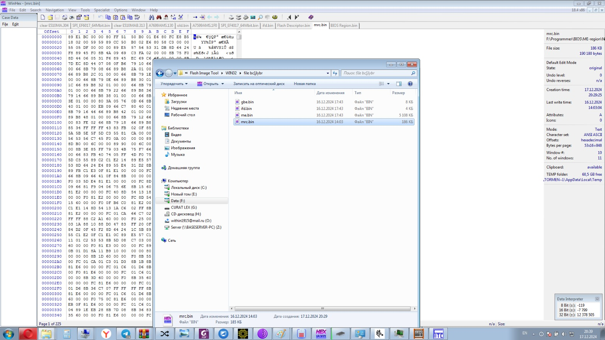
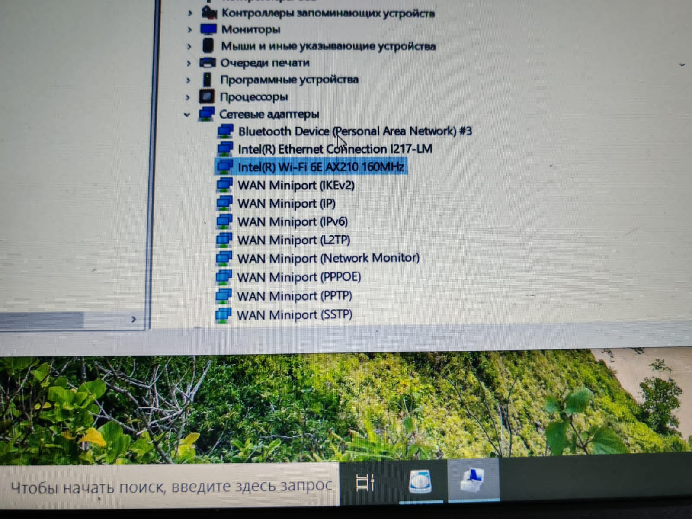
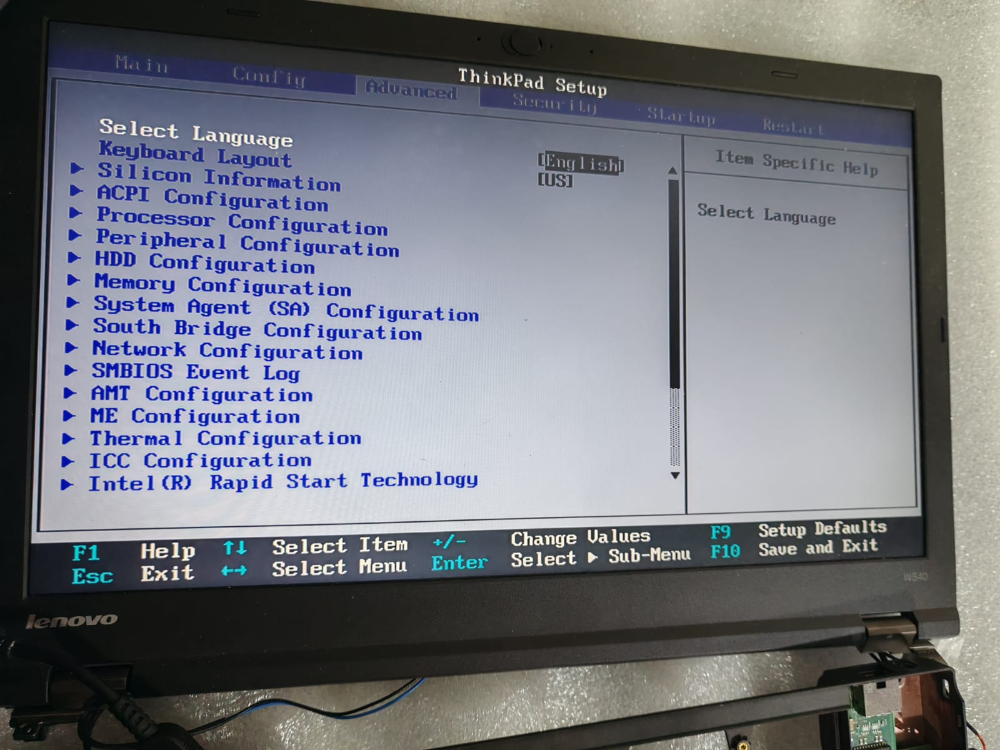

## 💻**Информация о репозитории**🚀

Данный репозиторий содержит следующие файлы и архивы, которые могут быть полезны для владельцев ноутбуков ThinkPad W540 и W541:

- **Оригинальный BIOS**  
  Файл с заводской прошивкой BIOS для моделей W540/W541.

- **Дамп BIOS и ME региона**  
  Дампы BIOS и Management Engine (ME) региона, которые могут быть использованы для анализа или восстановления.

- **Архив белого листа**  
  Архив, содержащий файлы для удаления ограничений белого листа (White List), что позволяет устанавливать неоригинальные модули, такие как WiFi-карты, без проблем с совместимостью.

Эти архивы и файлы совместимы как с моделями W540, так и с W541, что делает их универсальными для пользователей обеих версий.

---

# 💻 ThinkPad W540: Мощь Без Границ 🚀

<table align="center">
  <tr>
    <td></td>
    <td></td>
    <td></td>
  </tr>
</table>

---

## 🔧 Технические Характеристики

### **Процессор (CPU)**
- **Intel Core i7-4810MQ (Haswell)**  
  - 4 ядра / 8 потоков  
  - Базовая частота: 2.8 GHz, Turbo Boost: до 3.8 GHz  
  - TDP: 47 Вт  

### **Память**
- **DDR3L 32GB** (4x8GB)  
  - Поддержка частот до 2133 MHz  
  - Режим Dual Channel

### **Графика (GPU)**
- **Интегрированная:** Intel HD Graphics 4600  
- **Дискретная:** NVIDIA Quadro K2100M (2 GB GDDR5)  

### **Аудио**
- **Realtek ALC292**  
  - Поддержка Dolby Home Theater v4  
  - Чистый звук через 3.5 мм Jack

### **Сеть**
- **Ethernet:** Intel I217-LM (Gigabit)  
- **WiFi 6E:** Intel AX210 

---

## 🛠 Модификации и Улучшения

### **Удаление White List + Разблокировка BIOS**
1. **Инструменты:**  
   - Программатор CH341A + SOIC-8 клипса

---

## 🌐 Внешние Ресурсы

- 🐮 [Обсуждение Coreboot на Reddit](https://www.reddit.com/r/coreboot/comments/12oeag8/thinkpad_w541_coreboottianocore_guide/)
- 🐈 [Руководство по Coreboot от NekoEa](https://blog.nekoea.red/posts/coreboot/)
