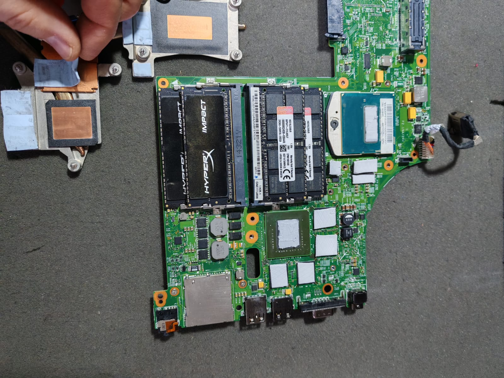
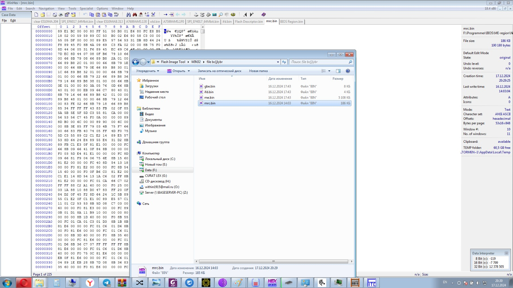
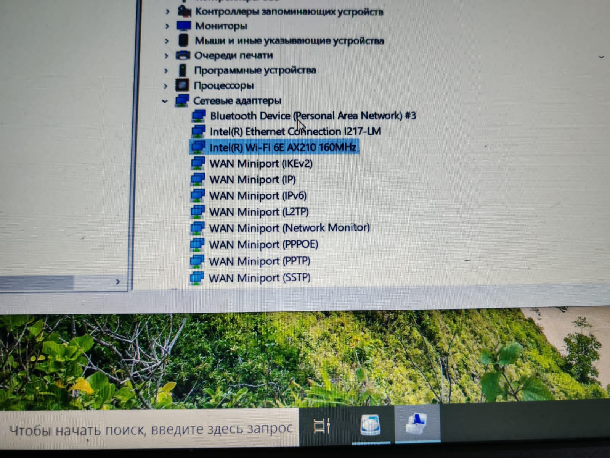
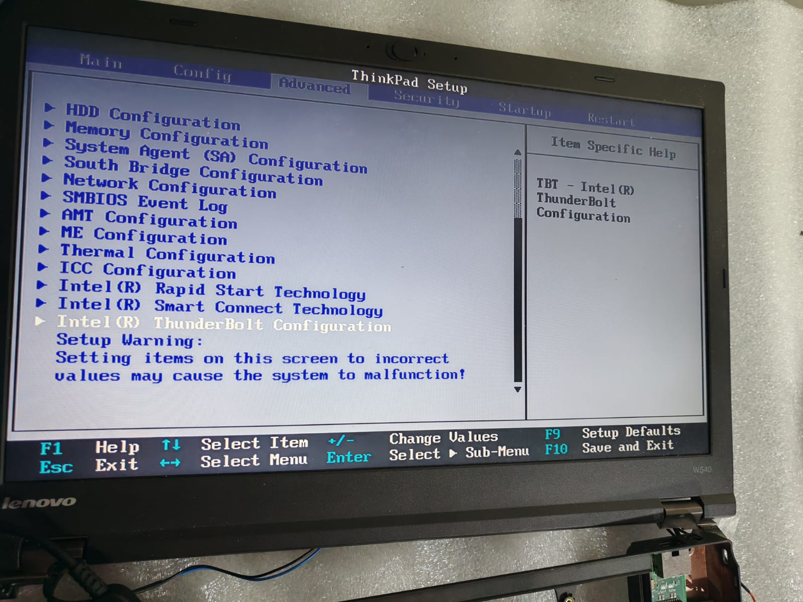
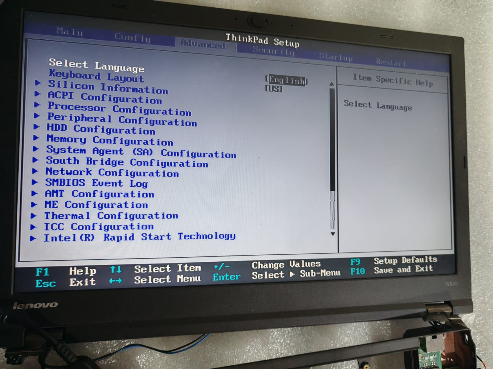

# 💻 ThinkPad W540: Мощь Без Границ 🚀

<div align="center">
  
  
  
  
  
</div>

---

## 🔧 Технические Характеристики

### **Процессор (CPU)**
- **Intel Core i7-4810MQ (Haswell)**  
  ▸ 4 ядра / 8 потоков  
  ▸ Базовая частота: 2.8 GHz, Turbo Boost: до 3.8 GHz  
  ▸ TDP: 47 Вт  

### **Память**
- **DDR3L 32GB** (4x8GB)  
  ▸ Поддержка частот до 2133 MHz  
  ▸ Режим Dual Channel

### **Графика (GPU)**
- **Интегрированная:** Intel HD Graphics 4600  
- **Дискретная:** NVIDIA Quadro K2100M (2 GB GDDR5)  

### **Аудио**
- **Realtek ALC292**  
  ▸ Поддержка Dolby Home Theater v4  
  ▸ Чистый звук через 3.5 мм Jack

### **Сеть**
- **Ethernet:** Intel I217-LM (Gigabit)  
- **WiFi 6E:** Intel AX210  
  ▸ Поддержка 6 ГГц диапазона  
  ▸ Скорость до 2.4 Гбит/с  

---

## 🛠 Модификации и Улучшения

### **Удаление White List + Разблокировка BIOS**
1. **Инструменты:**  
   - Программатор CH341A + SOIC-8 клипса
     
---

🌐 Внешние Ресурсы

    🐮 Обсуждение Coreboot на Reddit [Reddit]((https://www.reddit.com/r/coreboot/comments/12oeag8/thinkpad_w541_coreboottianocore_guide/))

    🐈 Руководство по Coreboot от NekoEa [Coreboot](https://blog.nekoea.red/posts/coreboot/))
    
---

2. **Процесс:**
   ```bash
   # Дамп текущего BIOS
   flashrom -p ch341a_spi -r backup.rom

   # Прошивка модифицированной версии
   flashrom -p ch341a_spi -w unlocked_bios.rom --verify
